Explorando Dados Geomagnéticos
================

-   [Origem dos Dados e Objetivos](#origem-dos-dados-e-objetivos)
-   [Entendendo os Dados](#entendendo-os-dados)
-   [Importando os dados e alterando as "labels"](#importando-os-dados-e-alterando-as-labels)
-   [Conversão de Data/Hora](#conversão-de-datahora)
-   [Representação Gráfica dos Dados](#representação-gráfica-dos-dados)
-   [Removendo Variáveis Não Utilizadas](#removendo-variáveis-não-utilizadas)
-   [Falha nos dados](#falha-nos-dados)
-   [Download dos Dados](#download-dos-dados)
-   [Importando os dados de Kakioka](#importando-os-dados-de-kakioka)
-   [Histogram](#histogram)
-   [BoxPlot](#boxplot)
-   [Referências](#referências)

### Origem dos Dados e Objetivos

Interações entre o Sol e a Terra, parte da área chamada Clima Espacial, causam impactos sociais e tecnológicos. Métodos para medir essas interações existem, porém em muitos casos os dados ficam disponíveis muito após aos eventos geomagnéticos \[4\].


Os dados utilizados neste projeto são provenientes do Satélite ACE (Advanced Composition Explorer), lançado pela NASA para melhorar as previsões dos efeitos dos ventos solares \[1\]. Índices geomagnéticos caracterizam as condições do campo geomagnético da Terra sem a necessidade de manipulação de quantidade massiva de dados \[2\].

Tendo definido os conceitos e a origem dos dados, objetiva-se então buscar correlações entre os dados geomagnéticos do ACE e os índices AE (Auroral Electroject), Sym-H (Symetric-H) e Asy-H (Asymetric-H).

Essa amostra de dados cobrem 122 dias entre 2003-08-01 ~ 2003-11-30;

Os dados podem ser obtidos em: [SPDF OMNIWeb Plus service website](https://omniweb.gsfc.nasa.gov/):

### Entendendo os Dados

| COLUMN | ITEMS                       | FORMAT |
|--------|-----------------------------|--------|
| 1      | Year                        | I4     |
| 2      | Day                         | I4     |
| 3      | Hour                        | I3     |
| 4      | Minute                      | I3     |
| 5      | Field magnitude average, nT | F8.2   |
| 6      | BX, nT (GSE, GSM)           | F8.2   |
| 7      | BY, nT (GSM)                | F8.2   |
| 8      | BZ, nT (GSM)                | F8.2   |
| 9      | Speed, km/s                 | F8.1   |
| 10     | Vx Velocity,km/s            | F8.1   |
| 11     | Proton Density, n/cc        | F7.2   |
| 12     | Temperature, K              | F9.0   |
| 13     | Flow pressure, nPa          | F6.2   |
| 14     | Electric field, mV/m        | F7.2   |
| 15     | Total Plasma beta           | F7.2   |
| 16     | AE-index, nT                | I6     |
| 17     | SYM/H, nT                   | I6     |
| 18     | ASY/H, nT                   | I6     |
| 19     | PCN-index                   | F7.2   |

Neste trabalho serão utilizados as seguintes colunas:

| COLUMN | ITEMS                | DataSynthesis                |
|--------|----------------------|------------------------------|
| 6      | BX, nT (GSE, GSM)    | Magnetic Field X Component   |
| 7      | BY, nT (GSM)         | Magnetic Field Y Component   |
| 8      | BZ, nT (GSM)         | Magnetic Field Z Component   |
| 10     | Vx Velocity,km/s     | Velocity of Solar Wind       |
| 11     | Proton Density, n/cc | Proton Density of Solar Wind |
| 12     | Temperature, K       | Temperature of Solar Wind    |
| 16     | AE-index, nT         | AE Geomagnetic Index         |
| 17     | SYM/H, nT            | Sym-H Geomagnetic Index      |
| 18     | ASY/H, nT            | Asy-H Geomagnetic Index      |

**Componentes do Campo Geomagnético (BX, BY e BZ)**

O campo geomagnético da terra pode ser medido quantitativamente como um vetor, conforme apresenta figura abaixo:


Através de três componentes, é possivel obter as outras, utilizando suas relações trigonométricas.


**Ventos Solares (Vx Velocity, Proton Density e Temperature)**

Os ventos solares são fluxos de partículas eletronicamente carregadas, Em tempestades solares, o fluxo de partículas torna-se muito intenso. Nesta condição, sua interação com a atmosfera torna-se muito importante, modificando as condições ionosféricas \[3\].

**Índices Geomagnéticos (AE, SYM-H, ASY-H)**

As variações do campo magnético terrestre são medidas através de dados obtidos dos magnetômetros. Devido à grande quantidade de medidas e do grande número de observatórios distribuídos pelo planeta, a manipulação desses dados é altamente complexa. Os índices geomagnéticos caracterizam e classificam as variações do campo magnético terrestre sem haver a necessidade de manipulação de dados massivos \[2\].

O índice AE (Auroral Electroject) foi originalmente introduzido em 1966 por Davis e Sugiura como uma medida da atividade magnética da zona auroral. Este índice é obtido através de dados de 12 observatórios localizado nas zonas aurorais no hemisfério norte, em resolução de minuto.

Os índices Asy-H e Sym-H (longitudinally asymmetric and symmetric) são utilizados para representar a perturbação geomagnética para médias latitudes, com dados em frequência de minuto.\[4\]

### Importando os dados e alterando as "labels"

``` r
setwd("~/Dropbox/Mestrado/CAP-386-Introduction-To-Data-Science/project/data")
data = read.table("data20030801to20031130.txt")
colnames(data) <- c("year", "day", "hour", "minute", "fma", "bx", "by", "bz", "speed", "vxvel", "pd", "temp", "flowpres", "electricfield", "tpb", "ae", "symh", "asyh", "pcn")

head(data)
```

    ##   year day hour minute  fma    bx   by    bz speed  vxvel   pd   temp
    ## 1 2003 213    0      0 6.89 -3.79 5.10 -1.14 815.7 -814.7 1.65 296709
    ## 2 2003 213    0      1 6.94 -2.40 5.54 -1.41 862.1 -861.1 1.70 292880
    ## 3 2003 213    0      2 6.94 -3.20 4.81 -2.96 802.8 -802.3 1.97 333668
    ## 4 2003 213    0      3 7.06 -2.96 4.08 -4.89 810.5 -809.2 1.92 320004
    ## 5 2003 213    0      4 7.05 -2.91 3.20 -5.51 817.3 -815.2 1.85 309686
    ## 6 2003 213    0      5 7.02 -2.42 3.79 -5.14 817.6 -815.7 1.60 316902
    ##   flowpres electricfield  tpb   ae symh asyh  pcn
    ## 1     2.20          0.93 0.61 1066  -25   64 4.13
    ## 2     2.53          1.22 0.62 1098  -24   69 4.15
    ## 3     2.54          2.38 0.79 1149  -24   71 4.20
    ## 4     2.52          3.96 0.72 1136  -23   70 4.26
    ## 5     2.47          4.50 0.68 1153  -22   71 4.42
    ## 6     2.14          4.20 0.60 1113  -22   72 4.41

### Conversão de Data/Hora

Nessa amostra de dados, as medidas são feitas em frequência de minutos, produzindo séries temporais que representam as variações da medida. Porém, não é possível representar uma série temporal no formato atual de representação de data/hora. (Year, day of Year, Hour and Minute). Isso pode ser resolvido criando uma coluna em um formato que englobe todos os valores.

``` r
data$dateTime <- strptime(paste(data$year, data$day, data$hour, data$minute), format="%Y %j %H %M")

head(data)
```

    ##   year day hour minute  fma    bx   by    bz speed  vxvel   pd   temp
    ## 1 2003 213    0      0 6.89 -3.79 5.10 -1.14 815.7 -814.7 1.65 296709
    ## 2 2003 213    0      1 6.94 -2.40 5.54 -1.41 862.1 -861.1 1.70 292880
    ## 3 2003 213    0      2 6.94 -3.20 4.81 -2.96 802.8 -802.3 1.97 333668
    ## 4 2003 213    0      3 7.06 -2.96 4.08 -4.89 810.5 -809.2 1.92 320004
    ## 5 2003 213    0      4 7.05 -2.91 3.20 -5.51 817.3 -815.2 1.85 309686
    ## 6 2003 213    0      5 7.02 -2.42 3.79 -5.14 817.6 -815.7 1.60 316902
    ##   flowpres electricfield  tpb   ae symh asyh  pcn            dateTime
    ## 1     2.20          0.93 0.61 1066  -25   64 4.13 2003-08-01 00:00:00
    ## 2     2.53          1.22 0.62 1098  -24   69 4.15 2003-08-01 00:01:00
    ## 3     2.54          2.38 0.79 1149  -24   71 4.20 2003-08-01 00:02:00
    ## 4     2.52          3.96 0.72 1136  -23   70 4.26 2003-08-01 00:03:00
    ## 5     2.47          4.50 0.68 1153  -22   71 4.42 2003-08-01 00:04:00
    ## 6     2.14          4.20 0.60 1113  -22   72 4.41 2003-08-01 00:05:00

### Representação Gráfica dos Dados

Vejamos como a série temporal de "Field Magnitude average" parece:

``` r
plot(data$dateTime, data$fma, type ='l')
```

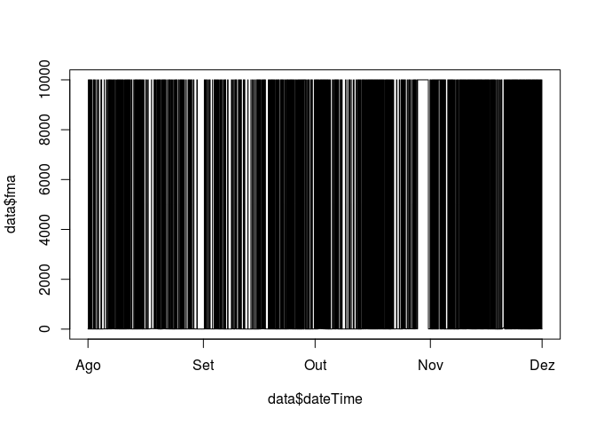

Os dados estão parecendo um código de barras! Será necessário limpar as falhas.

#### Limpando as falhas de "FMA"

Na coluna "Field Magnitude average", o valor mais alto apresentado é 9999.99, este valor representa as falhas dos equipamentos, vamos remove-los para ver como os dados serão representados:

``` r
data$fma[data$fma>=9999]<-NaN
plot(data$dateTime, data$fma, type ='l')
```

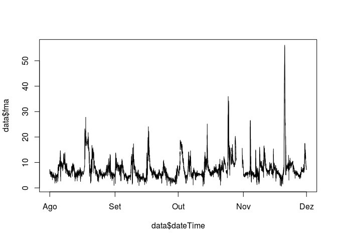

Agora os dados parecem uma série temporal de verdade!

<br> **Limpando BX**

``` r
data$bx[data$bx>=9999]<-NaN
plot(data$dateTime, data$bx, type ='l')
```

 <br> **Limpando BY**

``` r
data$by[data$by>=9999]<-NaN
plot(data$dateTime, data$by, type ='l')
```

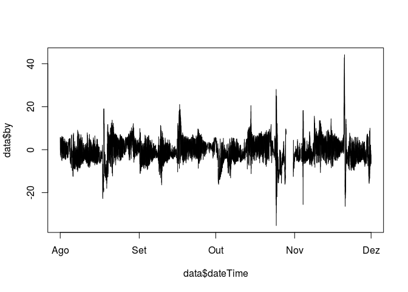 <br> **Limpando BZ**

``` r
data$bz[data$bz>=9999]<-NaN
plot(data$dateTime, data$bz, type ='l')
```

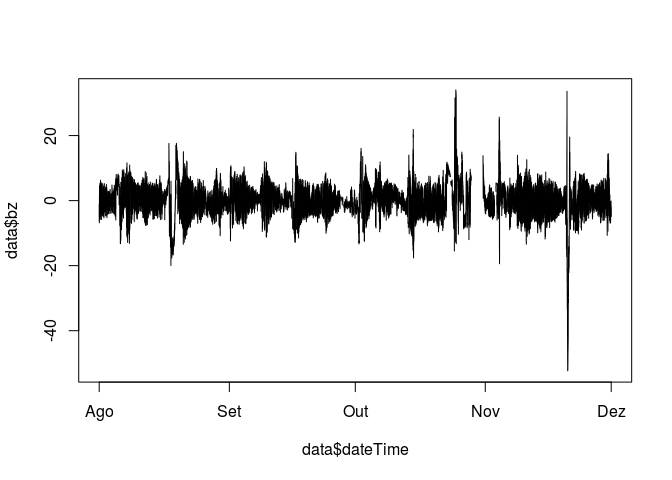 <br> **Limpando Velocity**

``` r
data$vxvel[data$vxvel>=9999]<-NaN
plot(data$dateTime, data$vxvel, type ='l')
```

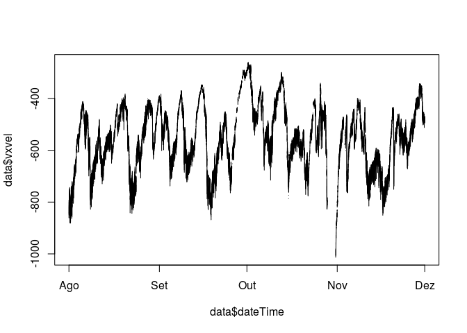 <br> **Limpando Proton Density**

``` r
data$pd[data$pd>=999]<-NaN
plot(data$dateTime, data$pd, type ='l')
```

 <br> **Limpando Temperature**

``` r
data$temp[data$temp>=9999999]<-NaN
plot(data$dateTime, data$temp, type ='l')
```

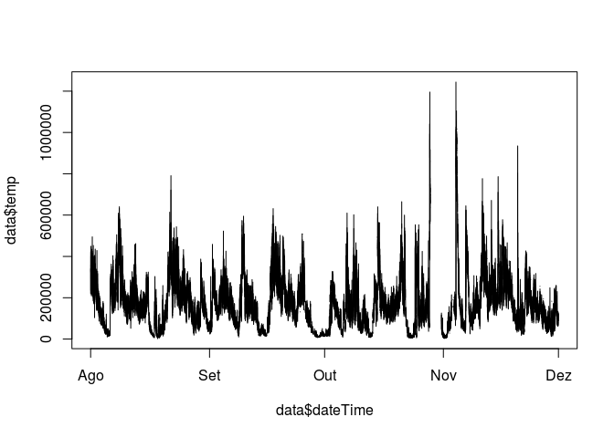 <br> **Limpando AE**

``` r
data$ae[data$ae>=9999]<-NaN
plot(data$dateTime, data$ae, type ='l')
```

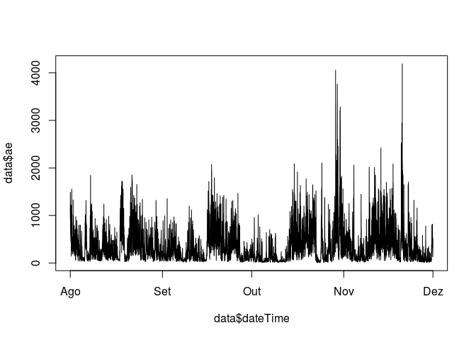 <br> **Limpando Sym-H **

``` r
data$symh[data$symh>=9999]<-NaN
plot(data$dateTime, data$symh, type ='l')
```

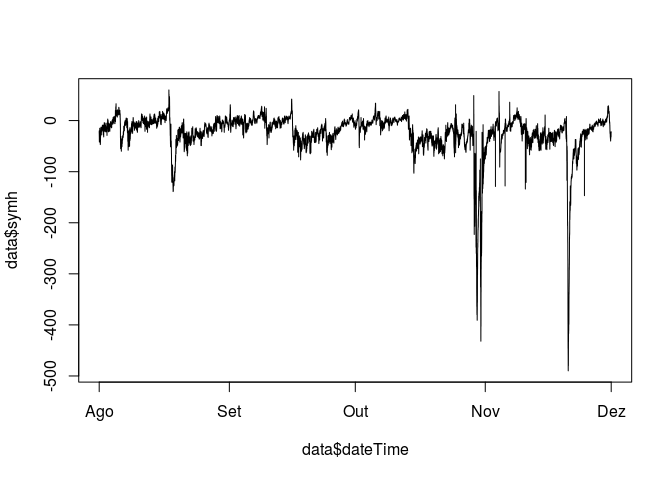 <br> **Limpando Asy-H**

``` r
data$asyh[data$asyh>=9999]<-NaN
plot(data$dateTime, data$asyh, type ='l')
```

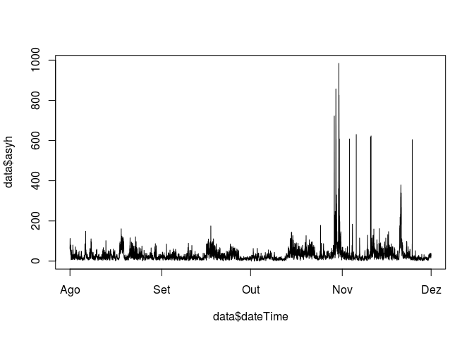

### Removendo Variáveis Não Utilizadas

Seguindo os objetivos do projeto, iremos remover as variáveis não utilizadas, deixando os dados "Tidy"

``` r
data$year <- NULL
data$day <- NULL
data$hour <- NULL
data$minute <- NULL
data$fma <- NULL
data$speed <- NULL
data$flowpres <- NULL
data$electricfield <- NULL
data$tpb <- NULL
data$pcn <- NULL

head(data)
```

    ##      bx   by    bz  vxvel   pd   temp   ae symh asyh            dateTime
    ## 1 -3.79 5.10 -1.14 -814.7 1.65 296709 1066  -25   64 2003-08-01 00:00:00
    ## 2 -2.40 5.54 -1.41 -861.1 1.70 292880 1098  -24   69 2003-08-01 00:01:00
    ## 3 -3.20 4.81 -2.96 -802.3 1.97 333668 1149  -24   71 2003-08-01 00:02:00
    ## 4 -2.96 4.08 -4.89 -809.2 1.92 320004 1136  -23   70 2003-08-01 00:03:00
    ## 5 -2.91 3.20 -5.51 -815.2 1.85 309686 1153  -22   71 2003-08-01 00:04:00
    ## 6 -2.42 3.79 -5.14 -815.7 1.60 316902 1113  -22   72 2003-08-01 00:05:00

### Falha nos dados

Há alguns eventos interessantes ocorrendo próximo a Novembro, porém os dados apresentam falhas neste periodo. Como tratar este tipo de falha de leitura?

Neste projeto será feito o Download dos dados Geomagnéticos de Kakioka, disponibilizados pela INTERMAGNET, aparentemente o mais estável observatório geomagnético da Terra \[4\], visando uma metodologia de tratamento de falha de dados.

### Download dos Dados

Os dados da INTERMAGNET são disponibilizados através do [site da rede](http://www.intermagnet.org/data-donnee/download-eng.php) ou através de conexão FTP. O método utilizado neste projeto foi o download por FTP, criando um script na linguagem Python, buscando dados de Kakioka deste mesmo período:

``` python
#Importing Libs
from ftplib import FTP #FTP Lib
import csv #CSV handler
import gzip #GZ file handler
import os #Working with OS (to remove files)

#Intermagnet adress
ip = "ftp.intermagnet.org"
login = "imaginpe"
pw = "d@a^DGE"

#Month to download
month = "11"

#FTP Directory String
directory = "/minute/definitive/IAGA2002/2003/"+month

#New Connection
ftpConnection = FTP(ip)
ftpConnection.login(login, pw)
ftpConnection.cwd(directory)

#Listing files
files = ftpConnection.nlst()
kakFiles = []

#Obtaining only Kakioka Files
for f in files:
    if f[0:3] == 'kak':
        kakFiles.append(f)

#For each file from kakioka, DO:
for file in kakFiles:

    #Download file
    ftpConnection.retrbinary("RETR " + file, open(file, 'wb').write)

    #Unzip it with gzip and read the content to a big string
    with gzip.open(file, 'rb') as f:
        file_content = f.read()

    #Split String and remove header lines
    content = file_content.split('\n')
    del content[0:26]

    #Remove Downloaded file 
    os.remove(file)

    #Open the CSV File and append data
    with open("kakData.csv", "ab") as fp:
        wr = csv.writer(fp,quotechar =',',quoting=csv.QUOTE_MINIMAL)
        wr.writerows(content)

#Close Connection
ftpConnection.quit()
```

### Importando os dados de Kakioka

``` r
setwd("~/Dropbox/Mestrado/CAP-386-Introduction-To-Data-Science/project")
dataKak = read.table("kakData.csv", header = FALSE, sep=" ")
colnames(dataKak) <- c("date", "hour", "DOY", "H", "D", "Z", "F")

head(dataKak)
```

    ##         date         hour DOY       H      D       Z       F
    ## 1 2003-08-01 00:00:00.000 213 29961.9 -422.5 35357.9 46345.5
    ## 2 2003-08-01 00:01:00.000 213 29961.4 -422.5 35357.3 46344.7
    ## 3 2003-08-01 00:02:00.000 213 29960.6 -422.5 35356.5 46343.6
    ## 4 2003-08-01 00:03:00.000 213 29961.0 -422.6 35356.3 46343.7
    ## 5 2003-08-01 00:04:00.000 213 29962.3 -422.7 35356.8 46344.9
    ## 6 2003-08-01 00:05:00.000 213 29962.9 -422.9 35357.1 46345.6

**Obtendo a Componente X utilizando relações trigonométricas**

``` r
dataKak$angD <- asin(dataKak$D/dataKak$H)
dataKak$X <- dataKak$H*cos(dataKak$angD)

plot(dataKak$angD, type = 'l')
```

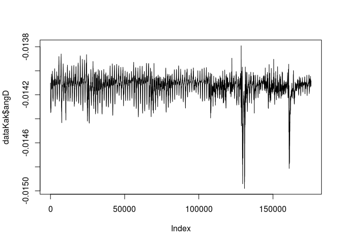

``` r
plot(dataKak$X, type = 'l')
```

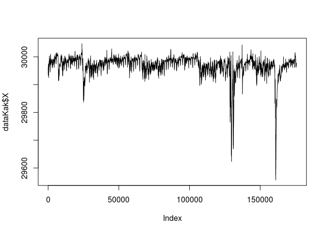

``` r
plot(dataKak$H, type = 'l')
```

 \#\#\# Juntando os Data Frames

``` r
data$Kakh <- (dataKak$H - mean(dataKak$H))
data$Kakd <- (dataKak$D - mean(dataKak$D))
data$Kakz <- (dataKak$Z - mean(dataKak$Z))
data$Kakx <- (dataKak$X - mean(dataKak$X))

head(data)
```

    ##      bx   by    bz  vxvel   pd   temp   ae symh asyh            dateTime
    ## 1 -3.79 5.10 -1.14 -814.7 1.65 296709 1066  -25   64 2003-08-01 00:00:00
    ## 2 -2.40 5.54 -1.41 -861.1 1.70 292880 1098  -24   69 2003-08-01 00:01:00
    ## 3 -3.20 4.81 -2.96 -802.3 1.97 333668 1149  -24   71 2003-08-01 00:02:00
    ## 4 -2.96 4.08 -4.89 -809.2 1.92 320004 1136  -23   70 2003-08-01 00:03:00
    ## 5 -2.91 3.20 -5.51 -815.2 1.85 309686 1153  -22   71 2003-08-01 00:04:00
    ## 6 -2.42 3.79 -5.14 -815.7 1.60 316902 1113  -22   72 2003-08-01 00:05:00
    ##         Kakh      Kakd     Kakz       Kakx
    ## 1  -9.426383 1.0400319 -21.0722  -9.412526
    ## 2  -9.926383 1.0400319 -21.6722  -9.912576
    ## 3 -10.726383 1.0400319 -22.4722 -10.712655
    ## 4 -10.326383 0.9400319 -22.6722 -10.314026
    ## 5  -9.026383 0.8400319 -22.1722  -9.015308
    ## 6  -8.426383 0.6400319 -21.8722  -8.418070

``` r
plot(data$bx, type='l')
```

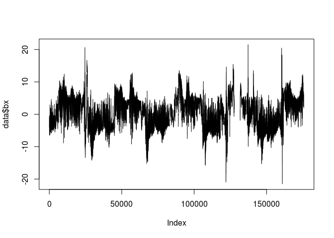

``` r
plot(data$Kakx, type='l')
```

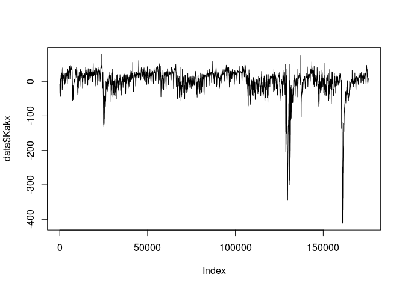

``` r
setwd("~/Dropbox/Mestrado/CAP-386-Introduction-To-Data-Science/project/data")
write.csv(data, file = "tidygeomagdata.csv")
```

### Histogram

``` r
par(mfrow=c(1,3),mar=c(6,3,2,1))
hist(data$bx)
hist(data$by)
hist(data$bz)
```

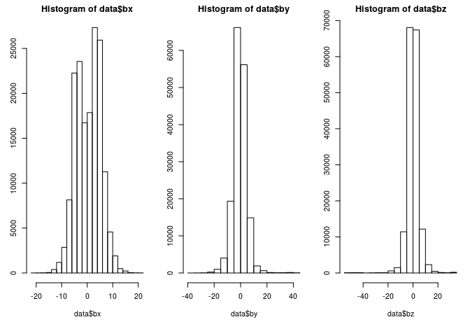

``` r
par(mfrow=c(1,3),mar=c(6,3,2,1))
hist(data$Kakx)
hist(data$Kakd)
hist(data$Kakz)
```

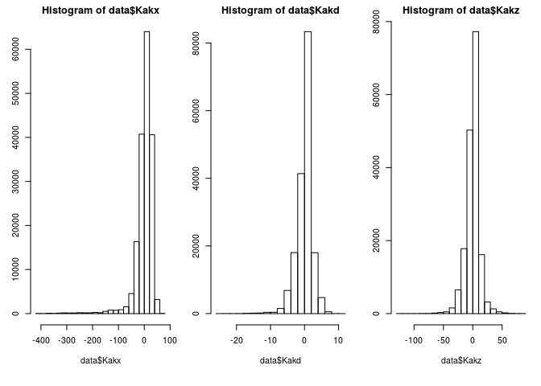

``` r
par(mfrow=c(1,3),mar=c(6,3,2,1))
hist(data$vxvel)
hist(data$pd)
hist(data$temp)
```

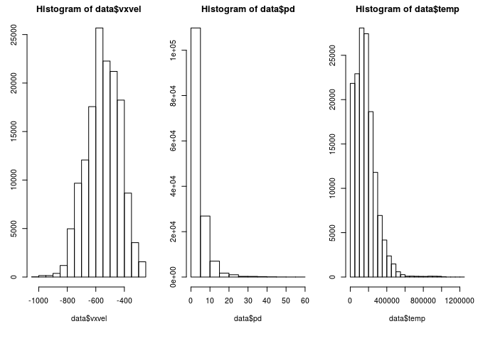

``` r
par(mfrow=c(1,3),mar=c(6,3,2,1))
hist(data$ae)
hist(data$symh)
hist(data$asyh)
```

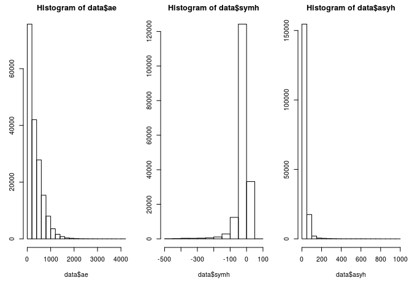

### BoxPlot

``` r
par(mfrow=c(1,3),mar=c(6,3,2,1))
boxplot(data$bx, main="Bx",las=2)
boxplot(data$by, main="By",las=2)
boxplot(data$bz, main="Bz",las=2)
```

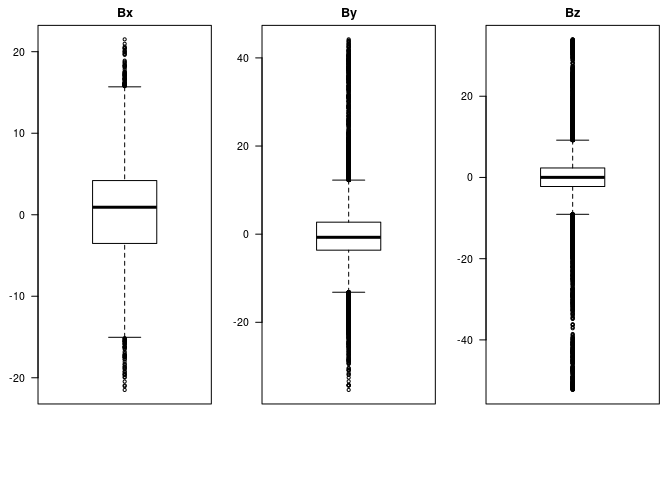

``` r
par(mfrow=c(1,3),mar=c(6,3,2,1))
boxplot(data$vxvel, main="Velocity",las=2)
boxplot(data$pd, main="Proton Density",las=2)
boxplot(data$temp, main="Temperature",las=2)
```

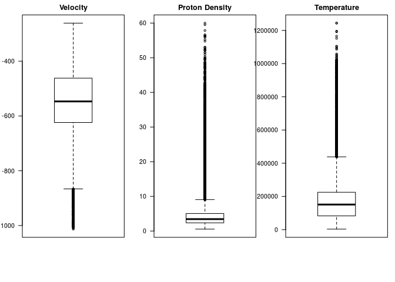

``` r
par(mfrow=c(1,3),mar=c(6,3,2,1))
boxplot(data$ae, main="AE",las=2)
boxplot(data$symh, main="Sym-H",las=2)
boxplot(data$asyh, main="Asy-H",las=2)
```

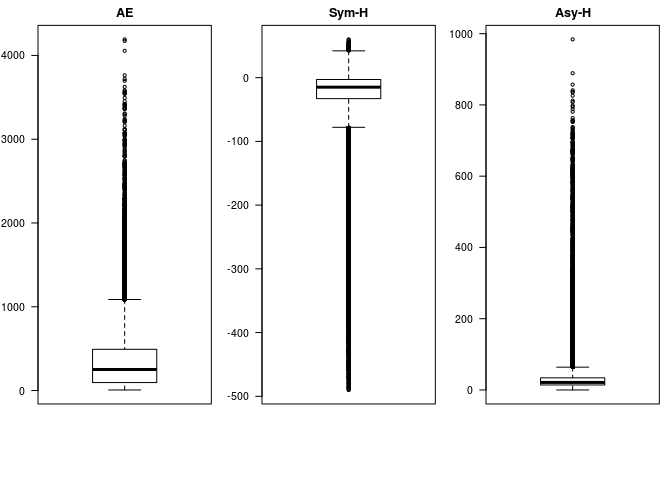

### Referências

\[1\] Advanced Composition Explorer(ACE), <http://www.srl.caltech.edu/ACE/>.

\[2\] KIVELSON, Margaret G; RUSSELL, Christopher T. Introduction to space physics, Cambridge university press, 1995.

\[3\] KIRCHOFF, V. W. J. H. Introdução a Geofísica Espacial, Editora Universidade de São Paulo, 1991.

\[4\] SEO, R. T. Aplicação Para Representação Gráfica de Variáveis Relacionadas a Perturbações Geomagnéticas, 2016.
